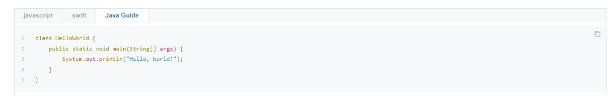
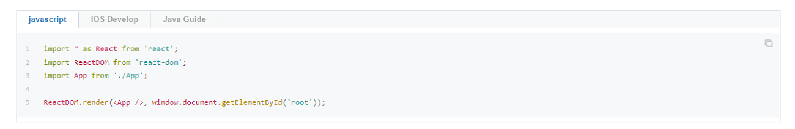

# Prism Code Tab

Gitbook Plugin for [Prism](http://prismjs.com/) and support code tabs with custom configuartion name.

[](https://www.npmjs.com/package/gitbook-plugin-prism)

Integrate [**gitbook-plugin-prism**](https://github.com/gaearon/gitbook-plugin-prism) and [**gitbook-plugin-codetabs**](https://github.com/GitbookIO/plugin-codetabs) into one plugin，it not only highlight code using [**Prism**](http://prismjs.com/), but can also using [**Tabs**](https://www.w3schools.com/w3css/w3css_tabulators.asp) to group these code blocks.

# Installation

Adds the plugin to your `book.json`, then run `gitbook install` if you are building your book locally.

```
{
    "plugins": ["prism-code-fox"]
}
```

# Usage

Each code block will render as a tab,the tab name is the language by default,but we can show custom tab name in each code block by using a `codeTabSepearator`.

The default value of `codeTabSepearator` is **`::`**, we can set a global value via `book.js` or set a custom value in each tab group as below:

```


​```javascript
 // code block
​```

​```swift#IOS Develop
 // code block
​```

​```java#Java Guide
 // code block
​```


```

Priority order is `Custom config` > `Global config` > `Default config`

## Default config

**Source code:**

```


​```javascript
import * as React from 'react';
import ReactDOM from 'react-dom';
import App from './App';

ReactDOM.render(<App />, window.document.getElementById('root'));
​```

​```swift
let s: String = "sample";
​```

​```java::Java Guide
class HelloWorld {
    public static void main(String[] args) {
        System.out.println("Hello, World!"); 
    }
}
​```


```

**Display result:**



## Global config

**Config code:**

```json
"prism-fox": {
    "theme": "prismjs/themes/prism-solarizedlight.min.css",
    "lang":{
        "dockerfile":"docker"
    },
    "markdown-table-selector": "li > p,blockquote > p",
    "details-summary":"Click to view more+"
}
```

**Source code:**

```


​```javascript
import * as React from 'react';
import ReactDOM from 'react-dom';
import App from './App';

ReactDOM.render(<App />, window.document.getElementById('root'));
​```

​```swift$IOS Develop
let s: String = "sample";
​```

​```java$Java Guide
class HelloWorld {
    public static void main(String[] args) {
        System.out.println("Hello, World!"); 
    }
}
​```


```

**Display result:**



## Custom config

**Source code:**

```


​```javascript
import * as React from 'react';
import ReactDOM from 'react-dom';
import App from './App';

ReactDOM.render(<App />, window.document.getElementById('root'));
​```

​```swift#IOS Develop
let s: String = "sample";
​```

​```java#Java Guide
class HelloWorld {
    public static void main(String[] args) {
        System.out.println("Hello, World!"); 
    }
}
​```


```

**Display result:**


# License

[**Apache License 2.0**](https://www.apache.org/licenses/LICENSE-2.0)